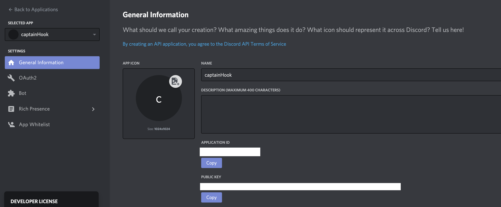

- [1. Introduction](#1-introduction)
- [1.1 Hébergement :](#11-hébergement-)
- [1.2. Technologies :](#12-technologies-)
- [2. Déploiement / installation  :](#2-déploiement--installation--)
- [2.1. Creation de l'application et du BOT sur Discord](#21-creation-de-lapplication-et-du-bot-sur-discord)
- [2.2. Déploiement sur Heroku](#22-déploiement-sur-heroku)
- [2.3 Webhooks](#23-webhooks)
- [3. Description de l'api créée avec Express.js](#3-description-de-lapi-créée-avec-expressjs)
  - [3.1 Discord.js](#31-discordjs)
  - [3.2 Routage avec express.Router](#32-routage-avec-expressrouter)
- [4. Schéma de l'application](#4-schéma-de-lapplication)
  
# 1. Introduction

Vous avez un projet déployé sur Netlify depuis un repo Github et vous souhaitez obtenir des notifications sur Discord dès qu'un push est effectué, ou que votre application est en cours de Build ou déployée ?
Notre app Captain Hook est faite pour vous ! 

**Capitaine Crochet** est un BOT Discord créé pour centraliser les notifications en provenance de netlify et de github sur deux channels d'un serveur privé sur Discord.

Avantage : il permet d'informer tous les collaborateurs d'un projet sur l'état du déploiement d'un site sur Netlify (pour contourner le fait que l'ajout de collaborateurs est payant).

**Capitaine Crochet** envoie, sur les channels auxquels il a accès : 
- des notifications concernant le deploiement de l'app sur netlify (build started, failed ou success)
- des notifications sur les push, les pull request et les merge sur le repository github


# 1.1 Hébergement :

Nous conseillons d'utiliser **Heroku** pour l'hebergement de l'application (ou tout autre solution offrant les mêmes possibilités).
Heroku est une PaaS (Plateform as a Service) qui permet d'héberger des applications sur le Cloud. L'avantage est surtout de pouvoir  déployer automatiquement les applications depuis des repos en ligne, hébergés sur Github par exemple.


# 1.2. Technologies : 

L'appli a été développée avec **Node.js**, plateforme logicielle libre en JavaScript, orientée vers les applications réseau scalables. Parmi les modules natifs de Node.js, on retrouve http qui permet le développement de serveur HTTP. Il est donc possible de se passer de serveurs web tels que Nginx ou Apache lors du déploiement de sites et d'applications web développés avec Node.js.

La partie serveur est développée avec **ExpressJS**, une infrastructure d'applications Web Node.js minimaliste et flexible qui fournit un ensemble de fonctionnalités robuste pour les applications Web et mobiles.
Grâce à plusieurs méthodes utilitaires HTTP la création d'une API robuste est simple et rapide.

L'appli utilise enfin le package **Discord.JS** qui permet d'intéragir facilement avec l'api de Discord et utiliser ses différentes fonctionnalités.
https://discord.js.org/#/


# 2. Déploiement / installation  :


# 2.1. Creation de l'application et du BOT sur Discord
Cette partie vous indique comment créer le BOT sur Discord. Vous pouvez passer au point suivant si votre BOT est déjà créé.

 - Créez une application dans la section "développeurs" de votre Discord, section Applications
  https://discord.com/developers/applications


 - L'ID de l'application ajouté dans l'URL suivant permet d'accéder à la liste des serveurs où l'on souhaite ajouter le BOT : https://discord.com/oauth2/authorize?client_id=YOUR_APP_ID&scope=bot

 - Ajoutez un BOT dans la partie BOT de l'application, c'est ici que vous pourrez récupérez le BOT TOKEN utilisé pour cette application


# 2.2. Déploiement sur Heroku

Vous devez au préalable créer un compte sur https://www.heroku.com/, et une nouvelle app.


Vous devez également créer un nouveau repo sur votre compte github  et y cloner le repo Captain Hook.

Sur la page de votre application, plusieurs onglets permettent de configurer l'app.


Sur l'onglet <u>Settings</u>, rendez vous dans *Config Vars* et cliquer sur **reveal**.
Les variables d'environnement suivantes (KEY=value) doivent être ajoutées :

BOT_TOKEN=your_bot_token
*Le bot token est récupérable sur votre application Discord, voir ici* #21-creation-de-lapplication-et-du-bot-sur-discord

GITHUB_CHANNEL_NAME=your_github_channel_name
*Dans cette variable, inscrivez le nom du channel de votre serveur discord où vous souhaitez que les notification provenant de github soient envoyées.*

NETLIFY_CHANNEL_NAME=your_netlify_channel_name
*Dans cette variable, inscrivez le nom du channel de votre serveur discord où vous souhaitez que les notification provenant de netlify soient envoyées.*

Rendez-vous ensuite dans l'onglet <u>Deploy</u>.
Choisissez Github dans la section *Deployment method* et connectez l'app à votre compte github. Si vous rencontrez des difficultés, la connexion est expliquée ici : https://devcenter.heroku.com/articles/github-integration

Assurez vous que le deploiement automatique soit activé dans Automatic deploys, sinon déployez manuelement la branche que vous souhaitez dans la section Manual Deploy.

Si votre app s'est déployée sans erreur, vous pouvez passer au chapitre suivant.

# 2.3 Webhooks

Pour que les notification soient envoyées, vous devez créer des WebHooks sur Netlify et Github. 
Avant de créer les webhooks, récupérez l'url de votre app sur Heroku, c'est vers elle que les webhooks vont pointer.

Qu'est ce qu'un webhook ?
Les webhooks permettent de déclencher une action suite à un événement. Ils sont généralement utilisés pour faire communiquer des systèmes. C’est la façon la plus simple de recevoir une alerte lorsque quelque chose se produit dans un autre système.

Sur github et netlify :

 - Les *webhooks github* permettent, lorsqu'un événements est déclenché sur un repository (push, pull request, merge...), d'envoyer une requête HTTP POST à l'URL configurée du webhook. Les webhooks peuvent être utilisés pour mettre à jour un outil de suivi des problèmes externe, déclencher des builds CI, mettre à jour un miroir de sauvegarde ou même déployer sur votre serveur de production. 
  https://docs.github.com/en/developers/webhooks-and-events/about-webhooks

- Sur Netlify, on utilise les *Webhooks sortants*. Ce type de notification permet d'envoyer des informations d'événement à une URL arbitraire à l'aide d'une requête POST. Le corps de la demande de webhook sortante aura une représentation JSON de l'objet pertinent pour l'événement.
  https://docs.netlify.com/site-deploys/notifications/#outgoing-webhooks


Nous supposons que vous avez déjà une app déployée sur Netlify depuis un repo github.
Si ce n'est pas le cas, cette app ne vous est d'aucune utilité ! 

<u>Créez vos webhooks</u> 

Les webhooks devront pointer vers l'url de votre app hébergée sur Heroku.

**Github**

Rendez vous dans l'onglet *Settings* du repo github que vous souhaitez "écouter" pour créer vos webhooks dans la section Webhooks

Créez deux webHooks différents, un pour les push, et un pour les pull request.

**Netlify**
Sur Netlify, cliquez sur *Site Settings* puis dans la section Build and Deploy, sur Deploy Notifications. 

Vous devez creer trois outgoing webhook différents :
- Deploy started
- Deploy failed
- Deploy succeeded

Vous pouvez choisir les évenements à trigger mais l'app risquerait de ne pas fonctionner comme souhaité. 
Si vous décidez d'écouter d'autres évènements, il vous faudra modifier le code détaillé dans le chapitre suivant.

# 3. Description de l'api créée avec Express.js

Notre app utilise **Express.js** pour le routage qui va "réceptionner" les webhooks, et le node module **discord.js** pour la communication avec l'application Discord et son Bot.

## 3.1 Discord.js

L'app express utilise le node module **discord.js** et instancie un Client.

Il faut ensuite se connecter au BOT grâce au token disponible et récupérer les channels sur lesquels le BOT va pouvoir envoyer des messsages
```js
const Discord = require('discord.js');
const client = new Discord.Client();


client.login('token'); 

client.on('ready', () => {
    
    const channels = client.channels.cache.array();
    ...
})

```
## 3.2 Routage avec express.Router

Deux routeurs Express sont utilisés pour construire les endpoints de l'api suivants : 
- pour github : github/push et github/pull
- pour netlify : netlify/fail, netlify/success, netlify/started 

A chaque push ou pull request sur le repository github concerné, les webhooks envoient des requetes HTTP POST sur les urls spécifiées.

Chaque route appelle une fonction spécifique qui récupère les informations souhaitées dans le corps de la requete POST et appelle la fonction send (propre à  Discord) pour envoyer un message sur le channel Discord désiré.

Exemple de la requete POST pour les notifications de "push" :

```js

// récupération des informations dans le body de la requête :
    const message = req.body.head_commit.message;
    const name = req.body.pusher.name;
    const repo = req.body.repository.name;
    const date = req.body.head_commit.timestamp;

// si le webhook a été déclenché par le merge de deux branches :

    if(message.includes('Merge')){
        console.log('#### merge notification ###');

        // création d'un message qui sera affiché sous forme de carte par Discord, avec différents champs

        const embed = new MessageEmbed()
            .setColor("GREEN")
            .setTitle("MERGED")
            .addField("Repo : ", repo)
            .addField("Message du merge : ", message || "Aucun contenu")
            .addField("Date : ", date);
            chan.github_channel.send(embed);
            
        res.json({
            text: "test"
        })

    // si c'est le push d'une branche locale qui a déclenché le webhook :
    } else {
        console.log('#### push notification request OK ###');
        const embed = new MessageEmbed()
            .setColor("YELLOW")
            .setTitle("PUSH")
            .addField("Repo : ", repo)
            .addField("Auteur du push : ", name)
            .addField("Message du commit : ", message || "Aucun contenu")
            .addField("Date : ", date);
            chan.github_channel.send(embed);
            
        res.json({
            text: "test"
        })
    }
}
```

# 4. Schéma de l'application


